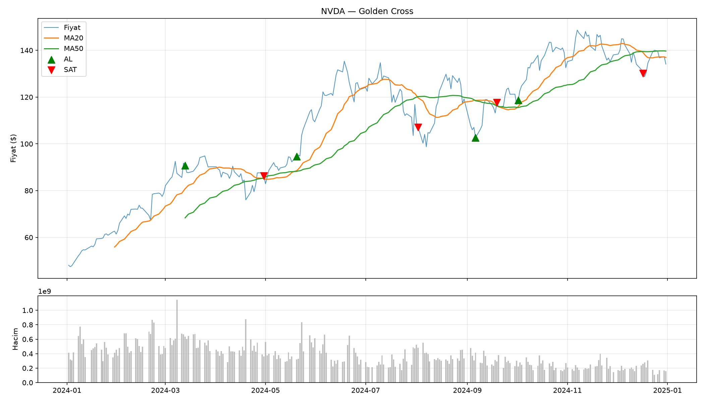

Teknik Analiz ve Algoritmik Backtest Aracı

Bu proje, Python kullanarak hisse senetleri için anlık veri çekebileceğiniz, popüler teknik göstergeleri hesaplayabileceğiniz, 4 ana stratejiyi ve kendi yazacağınız stratejileri test edebileceğiniz (backtest) ve sonuçları grafiksel olarak görselleştirebileceğiniz bir araçtır.


Özellikler

Bu araç iki ana modülden oluşmaktadır: Göstergeler ve Stratejiler.

1. Teknik Göstergeler

Piyasanın yönünü, oynaklığını ve momentumunu analiz etmek için anlık değer hesaplamaları:

MA & EMA: Basit ve Üstel Hareketli Ortalamalar (20 ve 50 günlük).

RSI: Göreceli Güç Endeksi ile aşırı alım/satım bölgelerinin tespiti.

MACD: Trend dönüşümlerini yakalamak için MACD, Sinyal ve Histogram hesaplamaları.

Bollinger Bantları: Piyasa oynaklığını ölçmek için Alt, Orta ve Üst bant değerleri.

2. Algoritmik Stratejiler ve Backtest

Belirli kurallara göre oluşturulmuş 4 ana  stratejinin geçmiş veriler üzerinde test edilmesi ve "Al & Tut" (Buy & Hold) getirisi ile kıyaslanması:

Golden Cross: Kısa vadeli ortalamanın (MA20), uzun vadeli ortalamayı (MA50) yukarı kesmesi ile al pozisyonuna girip kısa vadeli ortalamanın (MA20), uzun vadeli ortalamayı aşağıdan kesmesiyle sattığımız strateji.

RSI Stratejisi: RSI < 30 bölgesinde AL, RSI > 70 bölgesinde SAT mantığı.

MACD Crossover: MACD çizgisinin Sinyal çizgisini kestiği noktalara dayalı al/sat.

Bollinger Stratejisi: Fiyatın alt bandı deldiğinde AL, üst bandı aştığında SAT mantığı.

3. Görselleştirme
Çalıştırılan her strateji, al-sat noktaları (yeşil ve kırmızı oklar) ile birlikte otomatik olarak bir Matplotlib grafiğine dönüştürülür.


Kurulum ve Gereksinimler

Gerekli kütüphaneleri kurmak için terminalinize şu komutu yazın:

pip install pandas numpy matplotlib yfinance


Nasıl Kullanılır?
1. Proje dosyasını terminal veya komut satırı üzerinden çalıştırın:

python Technical-analysis.py

2. Araç sizden analiz etmek istediğiniz hissenin borsadaki kodunu ve tarih aralığını isteyecektir. Örnek:

Ticker: NVDA (veya AAPL, TSLA, BTC-USD vb.)

Başlangıç tarihi: 2023-01-01

Bitiş tarihi: 2024-12-31

3. Veriler başarıyla indirildikten sonra menü açılacaktır:

Göstergeler menüsünden hissenin anlık teknik değerlerini anında görüntüleyebilirsiniz.

Stratejiler menüsünden seçtiğiniz stratejinin geçmişte ne kadar sinyal ürettiğini, % kaç kâr/zarar getirdiğini görebilir ve grafiğini inceleyebilirsiniz.


Menü Ağacı
```
ANA MENÜ
 ├── 1) Göstergeler
 │   ├── 1) MA20
 │   ├── 2) MA50
 │   ├── 3) EMA20
 │   ├── 4) RSI
 │   ├── 5) MACD
 │   └── 6) Bollinger Bantları
 ├── 2) Stratejiler (Sinyal Üretimi, Backtest Sonucu ve Grafik Kaydı)
 │   ├── 1) Golden Cross
 │   ├── 2) RSI Stratejisi
 │   ├── 3) MACD Crossover
 │   └── 4) Bollinger Band
 └── 3) Çıkış
```

Ek Açıklama:

Bu araç üzerinden başta denildiği üzere 4 ana stratejiye göre girdiğiniz hisseyi test edebileceğiniz gibi aracı kendiniz özelleştirerek kendi stratejinizi yazarak bu stratejiyide test edebilirsiniz. Stratejiden kasıt TradingView'da kendi göstergenizi oluşturmak gibi aslında gösterge oluşturmuş oluyorsunuz ekstra kodlar yazarak veya var olan kodları özelleştirerek bunu yapabilirsiniz. Strateji için devreye diğer parametler giriyor ama bir gösterge oluşturmak isterseniz bu hazır şablonla beraber işiniz daha kolay olacak. Bu programa gösterge testinin iskeleti diyebiliriz.

Yasal Uyarı ve Sorumluluk Reddi 

Bu proje tamamen eğitim, araştırma ve kişisel gelişim amaçlı geliştirilmiştir. Kesinlikle bir yatırım tavsiyesi (YTD) değildir.
Araç tarafından sunulan "Backtest" sonuçları geçmiş fiyat hareketlerine dayalı teorik hesaplamalardır. Gerçek piyasa koşullarındaki komisyon ücretlerini, fiyat kaymalarını (slippage) ve likidite sorunlarını içermez. Geçmiş performans, gelecekteki sonuçların garantisi olamaz. Bu aracı kullanarak yapılan işlemlerden doğabilecek finansal kayıplardan kullanıcı sorumludur.

NVİDİA 2024-01-01 / 2025-01-01 GoldenCross

